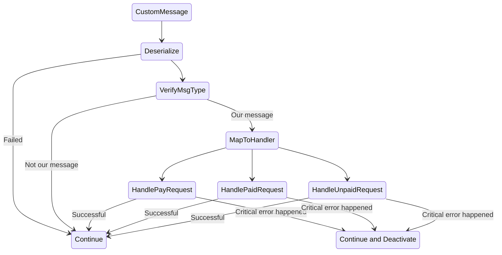
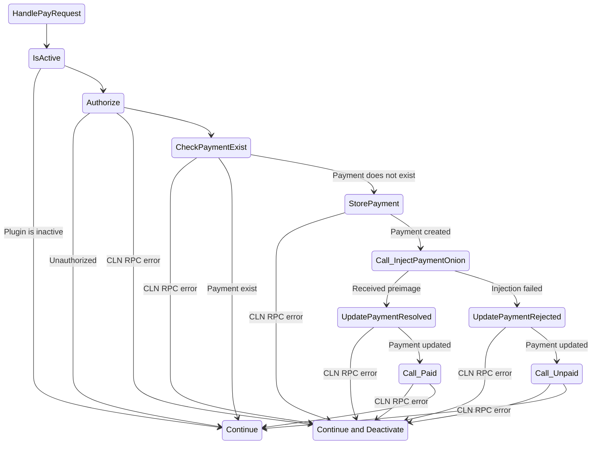
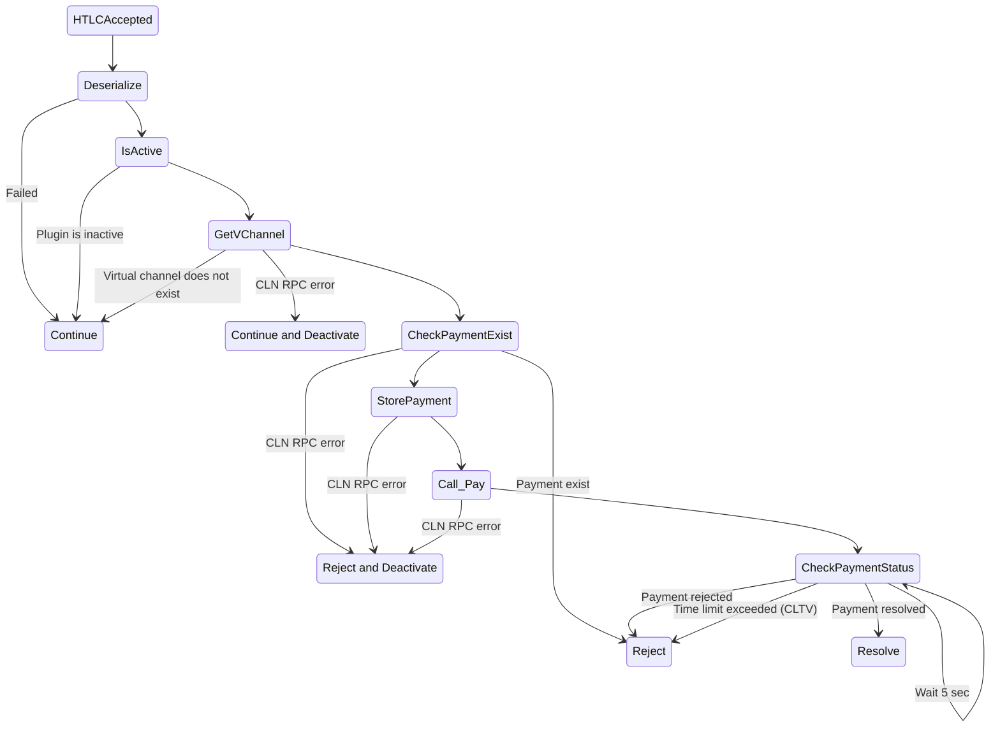

# C-Lightning plugin which allows transfers between nodes via virtual channels

Imagine we have the following network topology: A-B1--B2-C. The node C wants to receive a payment from A, and B1,B2 are
our nodes where we initialized a virtual channel. Then, the entire flow can be briefly described as follows:

1. We pay the C's invoice using `sendpay` by A. This invoice routes the payment to B1.
2. On B1 node we catch the `htcl_accepted` hook;
3. In the hook we check if the next channel is our virtual channel;
4. If yes, we submit a request using custom message to the next B2 node, which contains a payment onion for this node;
5. Upon receiving this message on B2 node, it executes the `injectpaymentonion` RPC request;
6. The B1 node in turn holds the hook, until it reaches CLTV or receives a response from B2;
7. If the onion injection was successful, the B2 node receives a preimage and sends it to B1 using custom message;
8. Upon receiving the preimage, the B1 node resolves the HTLC.

This plugin leverages the following assumptions:

- The payment for the unique payment hash can be processed only once;
- If any critical error happens, the plugin deactivates;
- If the plugin is deactivated, it will not accept any payments or HTLCs, but the node will finish processing existing
  payments.

## RPC

### `vch-open` - open a new virtual channel with peer. If the channel already exists, changes its status to `Opened`

Request example:

```json
{
  "peer_id": "nodeid020202020202020202020202020202020202020202020202020202020202"
}
```

Response example:

```json
{}
```

### `vch-close` - close a virtual channel, meaning changing its status to `Closed`

Request example:

```json
{
  "virtual_channel_id": "123x456x789"
}
```

Response example:

```json
{}
```

### `vch-list` - list virtual channels

Request example:

```json
{}
```

Response example:

```json
[
  {
    "virtual_channel_id": "123x456x789",
    "peer_id": "nodeid020202020202020202020202020202020202020202020202020202020202",
    "status": "Opened"
  },
  {
    "virtual_channel_id": "123x456x780",
    "peer_id": "nodeid020202020202020202020202020202020202020202020202020202020203",
    "status": "Closed"
  }
]
```

### `vch-status` - get current plugin status

Request example:

```json
{}
```

Response example:

```json
{
  "status": "true"
}
```

### `vch-activate` - activate plugin

Request and response are empty.

### `vch-deactivate` - deactivate plugin

Request and response are empty.

## Custom Messages

### Method: `vchannel_pay`. Request a payment via virtual channel.

Request example:

```json
{
  "next_onion": "onion303030303030303030303030303...",
  "payment_hash": "paymenthashinvl0270027002700270027002700270027002700270027002700",
  "amount_msat": 1111,
  "cltv": 10,
  "virtual_channel_id": "123x456x789"
}
```

### Method: `vchannel_paid`. Notifies about successful payment, contains preimage.

Request example:

```json
{
  "payment_hash": "paymenthashinvl0270027002700270027002700270027002700270027002700",
  "payment_preimage": "paymentsecretinvl00310003100031000310003100031000310003100031000"
}
```

### Method: `vchannel_unpaid`. Notifies about unsuccessful payment.

Request example:

```json
{
  "payment_hash": "paymenthashinvl0270027002700270027002700270027002700270027002700"
}
```

## `custommsg` hook handler



## `vchannel_pay` JSON-RPC handler



## `htlc_accepted` hook handler

